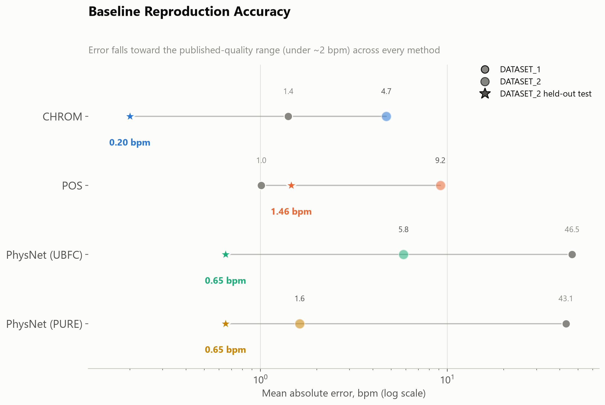
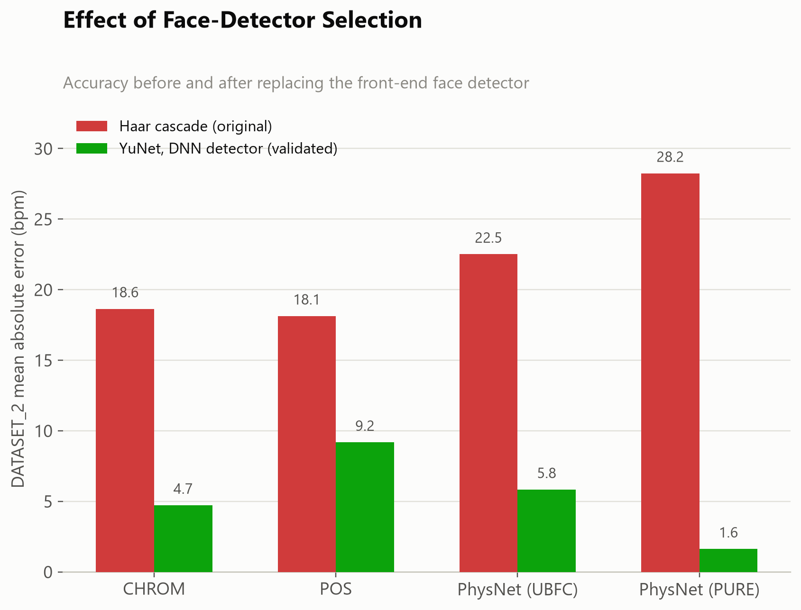
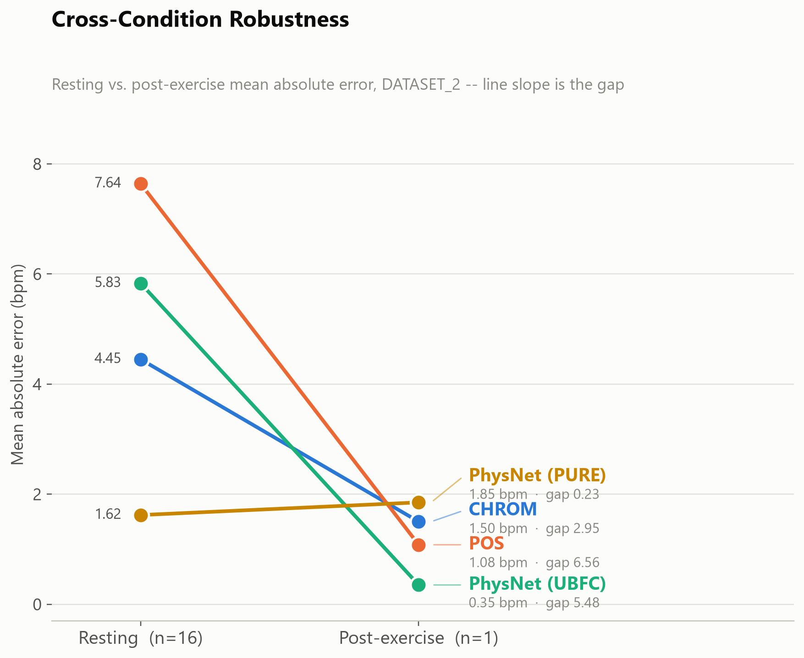
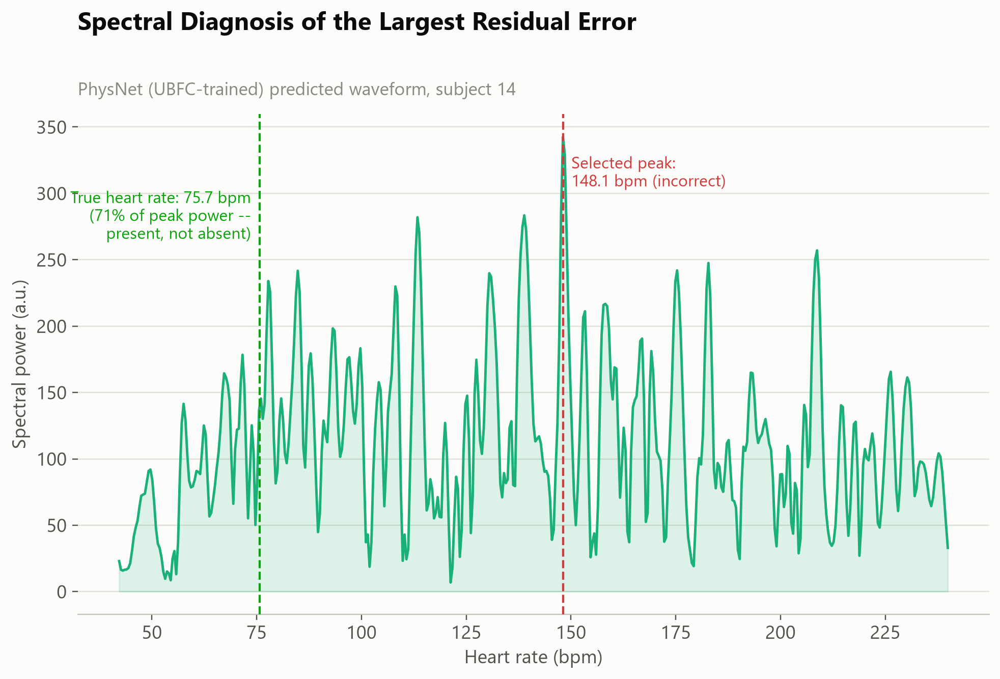
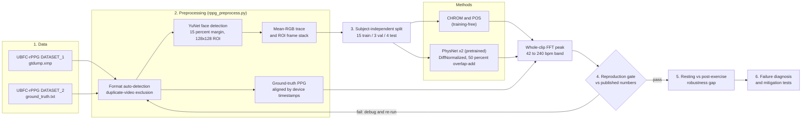
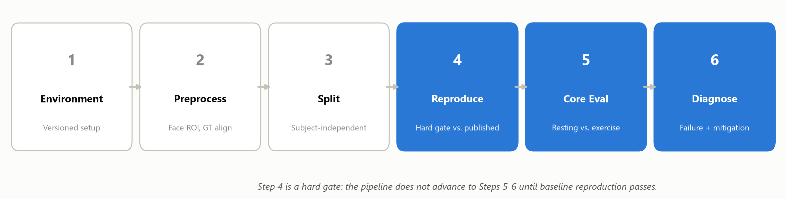

# A Rigor-First Audit of Remote Photoplethysmography (rPPG)

**Contactless Vital Sign Estimation from Face Video: Reproducibility and Robustness of Classical and Deep rPPG Baselines on UBFC-rPPG**

`CSE754: Deep Learning for Computer Vision` · BRAC University · Final Project


---

## 1. Overview

Remote photoplethysmography (rPPG) estimates heart rate from the faint colour changes a camera picks up in facial skin, with no wearable and no contact sensor. Published accuracy numbers look excellent, but they rarely come with two checks that matter before anyone can trust them: **is the pipeline implemented correctly, and does accuracy hold when conditions change?**

This project audits exactly that. We built an independent, subject-independent evaluation pipeline over **both public releases of UBFC-rPPG (22 pooled clips)** and used it to:

1. **Reproduce** four baselines to published-quality accuracy: two classical, training-free methods (**CHROM**, **POS**) and a deep spatiotemporal network (**PhysNet**, two pretrained checkpoints, inference-only).
2. **Find and fix three silent implementation defects**, each large enough to have produced a confident but false fairness or robustness conclusion.
3. **Diagnose a paradoxical result** (an "in-domain" checkpoint losing to a cross-dataset one) down to a checkpoint training-data mismatch, and confirm it empirically.
4. **Measure robustness** across resting versus post-exercise recording conditions.
5. **Diagnose a failure case** at the spectrum level and honestly test two post-hoc mitigations, both of which were **rejected** and are reported as negative results.

> **Scope note.** The project was originally proposed as a Fitzpatrick skin-tone fairness audit on MMPD and EquiPleth. Access to both gated datasets could not be obtained in time, so the same evaluation rigor was redirected to the condition axis the available data supports (resting vs. post-exercise). The skin-tone question is left open and listed under [future work](#7-limitations-and-future-work).

**Central claim:** reproducibility rigor is a precondition for fairness and robustness auditing in rPPG, not a separate concern. Every defect found here was individually capable of fabricating a convincing, wrong finding.

---

## 2. Key results

All values are heart-rate error in beats per minute, reported as **MAE / RMSE**.

| Method | DATASET_1 (n=6) | DATASET_2 (n=16) | DATASET_2 held-out test (n=4) |
|---|---|---|---|
| CHROM | 1.41 / 1.86 | 4.72 / 9.87 | **0.20 / 0.24** |
| POS | 1.01 / 1.57 | 9.18 / 18.50 | **1.46 / 2.20** |
| PhysNet (UBFC-trained checkpoint) | 46.54 / 57.34 | 5.83 / 18.23 | **0.65 / 1.09** |
| PhysNet (PURE-trained checkpoint) | 43.12 / 60.62 | 1.62 / 3.11 | **0.65 / 1.09** |

| Finding | Evidence |
|---|---|
| All four methods reproduce published-quality accuracy | 0.2 to 1.5 bpm MAE on the held-out DATASET_2 test split; PhysNet (PURE) cross-dataset reaches 1.62 bpm against a published 1.63 bpm |
| **Defect 1:** CHROM missing per-window demeaning | MAE 34.5 → 0.55 bpm |
| **Defect 2:** PhysNet chunk-boundary splicing artifact | Fixed with 50%-overlap Hann-windowed overlap-add reconstruction |
| **Defect 3:** Haar-cascade face detector cropped clothing, not skin | Replacing it with YuNet cut DATASET_2 MAE for every method (CHROM 18.64 → 4.72, POS 18.13 → 9.18, PhysNet-UBFC 22.51 → 5.83, PhysNet-PURE 28.24 → 1.62) |
| "UBFC" PhysNet checkpoint was never in-domain on DATASET_1 | 46.5 → 5.8 bpm (8x lower) once evaluated on DATASET_2, its true training domain, confirmed by tracing the training loader and by MD5-verifying the two checkpoints are distinct files |
| Resting vs. post-exercise gap (DATASET_2-clean view) | CHROM 4.45 vs 1.50 (gap 2.95) · POS 7.64 vs 1.08 (6.56) · PhysNet-UBFC 5.83 vs 0.35 (5.48) · PhysNet-PURE 1.62 vs 1.85 (0.23). *Single post-exercise clip, so directional only.* |
| Largest failure is peak *selection*, not a missing signal | subject14: model picked 148.1 bpm, true 75.7 bpm held 71% of the winning peak's power |
| Both post-hoc mitigations rejected | Lower-peak heuristic fixed subject14 (72.4 → 4.1 bpm) but degraded seven other clips; MAE 5.83 → 5.89 (a wash). Welch's-method estimator: fixed 3 to 4 clips, broke 3 to 4 |

<p align="center">
  
  
</p>
<p align="center">
  
  
</p>

---

## 3. Pipeline architecture

The evaluation is a six-step protocol. **Step 4 is a hard gate:** steps 5 and 6 only run once every baseline reproduces published numbers, because otherwise a "fairness" or "robustness" finding cannot be told apart from a pipeline bug.





### Stage by stage

| Step | Module | What it does |
|---|---|---|
| 1-2 | [`src/rppg_preprocess.py`](src/rppg_preprocess.py) | Auto-detects the two UBFC-rPPG layouts, excludes a byte-identical duplicate video (found by MD5 hashing), detects the largest face per frame with **YuNet**, crops a 128x128 ROI (15% margin), records the per-frame mean-RGB trace, and resamples ground-truth PPG onto frame timestamps using the sensor's own clock. |
| 3 | [`src/rppg_preprocess.py`](src/rppg_preprocess.py) | Splits **by person, never by frame or clip** (seeded), writing [`results/tables/split_manifest.csv`](results/tables/split_manifest.csv) so the split is exactly reproducible. |
| 4a | [`src/baselines_classical.py`](src/baselines_classical.py) | **CHROM** and **POS**: windowed chrominance projections with Hann overlap-add (including the per-window demeaning fix), then a band-passed FFT peak for heart rate. |
| 4b | [`src/physnet_infer.py`](src/physnet_infer.py) | **PhysNet** inference with two pretrained checkpoints: resample to 30 fps, resize to 72x72, DiffNormalized input, 128-frame chunks stitched by 50%-overlap Hann overlap-add. |
| 5 | [`src/step5_condition_analysis.py`](src/step5_condition_analysis.py) | Resting vs. post-exercise MAE per method and the absolute gap between them, reported both pooled and in a DATASET_2-only view that avoids a dataset-family confound. |
| 6 | [`src/make_figures.py`](src/make_figures.py) | Regenerates every result figure. The spectrum-level failure diagnosis (subject14) is recomputed from the processed data and checkpoint; the mitigation before/after chart plots the per-clip errors recorded in the mitigation experiment (described in the report, section 5.4). |

### Rigor checks built into the process

- **Duplicate-data detection:** MD5 hashing caught two subject folders whose videos were byte-identical despite different ground truth; both are excluded.
- **Artifact verification:** both PhysNet checkpoints are MD5-verified as distinct files (hashes are checked in [`scripts/download_models.py`](scripts/download_models.py)).
- **No test-set contamination:** the face-detector decision was re-validated on the three validation-split subjects, not only on the test-split subject that first exposed the defect.
- **Negative results are kept:** two mitigations that failed full-corpus evaluation are documented, not dropped.

---

## 4. Repository structure

```
.
├── src/                          # Pipeline code; run in the order shown in section 6
│   ├── rppg_preprocess.py        #   dataset discovery, YuNet ROI extraction, GT alignment, split
│   ├── baselines_classical.py    #   CHROM and POS
│   ├── physnet_infer.py          #   PhysNet pretrained inference + overlap-add reconstruction
│   ├── step5_condition_analysis.py   # resting vs post-exercise robustness
│   ├── make_figures.py           #   result figures (light and slide-deck variants)
│   └── make_schematic_figures.py #   research-question / literature / workflow schematics
├── scripts/
│   └── download_models.py        # fetches PhysNet code + checkpoints and YuNet, verifies MD5
├── models/                       # populated by download_models.py (weights are git-ignored)
├── data/                         # place raw UBFC-rPPG here (git-ignored); see data/README.md
├── results/
│   ├── tables/                   # split manifest, per-method metrics, step-5 per-clip + summary
│   └── logs/                     # console logs of the final pipeline runs
├── docs/
│   ├── report/Final_Report.pdf   # full project report (18 pages)
│   ├── presentation/             # final slides (PPTX) and speaker notes (PDF)
│   └── figures/                  # all figures used in the README and report
├── requirements.txt
└── README.md
```

---

## 5. Methods at a glance

- **Data:** UBFC-rPPG, pooled across both public releases. DATASET_1 contributes 6 clips (8 minus 2 excluded duplicates, ground truth in `gtdump.xmp` at about 62 Hz); DATASET_2 contributes 16 clips from the standard 42-subject benchmark (`ground_truth.txt`). Every clip is tagged with its dataset family so results stay decomposable.
- **Split:** 15 train / 3 validation / 4 test subjects, by person. The held-out test subjects all come from DATASET_2, matching the published benchmark protocol.
- **Classical baselines:** CHROM and POS, closed-form and training-free.
- **Deep baseline:** PhysNet from rPPG-Toolbox, **inference only**. With 22 clips, training from scratch would overfit, so the deep model is held to the same reproduction standard as the classical ones.
- **Heart-rate estimate:** one value per clip from the dominant FFT peak of the band-passed reconstructed pulse in 42 to 240 bpm.
- **Metrics:** MAE and RMSE in bpm, always broken out by corpus slice, split, and condition.

---

## 6. Getting started

**Requirements:** Python 3.11, CPU is sufficient. Developed and tested on Windows with Python 3.11, NumPy 2.4, SciPy 1.17, pandas 3.0, PyTorch 2.14 (CPU), OpenCV 4.10 and Matplotlib 3.11.

```bash
# 1. install dependencies
pip install -r requirements.txt

# 2. fetch third-party models (PhysNet code and checkpoints, YuNet detector)
python scripts/download_models.py

# 3. obtain UBFC-rPPG from its authors and place it at data/raw/UBFC_DATASET/
#    (or point UBFC_ROOT at wherever it lives), see data/README.md

# 4. run the pipeline
python src/rppg_preprocess.py            # ROI extraction, GT alignment, split manifest
python src/baselines_classical.py        # CHROM and POS
python src/physnet_infer.py              # PhysNet, both pretrained checkpoints
python src/step5_condition_analysis.py   # resting vs post-exercise robustness
python src/make_figures.py               # regenerate result figures into docs/figures/
```

Outputs land in `results/tables/` (metrics) and `data/processed/` (large intermediates, git-ignored). The result tables committed in this repository are the ones the report and slides are built from.

---

## 7. Limitations and future work

- **Small evaluation set:** 22 pooled clips (4 held-out test subjects) and a single post-exercise clip, so the condition gap is directional evidence, not a statistically powered estimate.
- **Skin-tone fairness untested:** the originally planned Fitzpatrick-stratified audit on MMPD / EquiPleth was not possible without gated data. This pipeline is ready to be reused for it.
- **One unresolved regression:** both PhysNet checkpoints degrade on DATASET_1 after the face-detector change. A crop-margin ablation is the proposed next step to test the leading hypothesis (tighter crops on already tightly framed videos).
- **Reusable checklist:** the checks above (duplicate-data detection, checkpoint provenance, held-out validation of preprocessing choices, full-corpus testing of post-hoc fixes) are intended as a template for future rPPG fairness audits.

---

## 8. Documents

| Document | Location |
|---|---|
| Final report (18 pages) | [`docs/report/Final_Report.pdf`](docs/report/Final_Report.pdf) |
| Final presentation | [`docs/presentation/Final_Presentation.pptx`](docs/presentation/Final_Presentation.pptx) |
| Speaker notes | [`docs/presentation/Speaker_Notes.pdf`](docs/presentation/Speaker_Notes.pdf) |

---

## 9. Team

- **Noshin Tabassum Arthi**
- **Samin Ahsan Tausif**

Supervisor: **Dr. Md. Ashraful Alam**, BRAC University.

---

## 10. References and acknowledgements

- G. de Haan and V. Jeanne, "Robust pulse rate from chrominance-based rPPG," *IEEE TBME*, 2013. (CHROM)
- W. Wang, A. C. den Brinker, S. Stuijk, and G. de Haan, "Algorithmic principles of remote PPG," *IEEE TBME*, 2017. (POS)
- Z. Yu, X. Li, and G. Zhao, "Remote photoplethysmograph signal measurement from facial videos using spatio-temporal networks," *BMVC*, 2019. (PhysNet)
- X. Liu et al., "rPPG-Toolbox: Deep remote PPG toolbox," *NeurIPS Datasets and Benchmarks*, 2023. (PhysNet implementation and pretrained checkpoints)
- S. Bobbia, R. Macwan, Y. Benezeth, A. Mansouri, and J. Dubois, "Unsupervised skin tissue segmentation for remote photoplethysmography," *Pattern Recognition Letters*, 2017. (UBFC-rPPG dataset; **not redistributed here**, please obtain it from the authors and cite their work)
- YuNet face detector via the [OpenCV Zoo](https://github.com/opencv/opencv_zoo).

The UBFC-rPPG videos, derived face crops, and third-party model weights are intentionally excluded from this repository.
